\newcommand{\vb}[1]{\mathbf{#1}}      
\newcommand{\vbs}[1]{\boldsymbol{#1}} 
\newcommand{\BlankRow}{\vphantom{\vb{I}_{22}}}

\newcommand{\mqty}[1]{\begin{matrix}#1\end{matrix}}
\newcommand{\pmqty}[1]{\left(\begin{matrix}#1\end{matrix}\right)} 
\newcommand{\bmqty}[1]{\left[\begin{matrix}#1\end{matrix}\right]} 
\newcommand{\vmqty}[1]{\left\|\begin{matrix}#1\end{matrix}\right\|} 
\newcommand{\mqtyv}[1]{\left|\begin{matrix}#1\end{matrix}\right|} 
\newcommand{\Pmqty}[1]{\left\{\begin{matrix}#1\end{matrix}\right\}} 
\DeclareMathOperator{\diag}{diag}

\newpage

```{r}
#| label: setup
#| echo: FALSE
#| include: FALSE
library(readxl)
library(tidyverse)
library(ggthemes)
library(ggpubr)
library(showtext)
library(stringi)
library(latex2exp)
library(flextable)
library(ggtext)
library(geofacet)
library(scales)
library(ggpattern)
library(ggridges)
library(ggbreak)
library(spatstat)
library(sandwich)
library(lmtest)
library(ggcorrplot)
library(glue)
library(targets)
library(ggh4x)
set.seed(12345)
#------------------------------------------------#
# GLOBAL SETTINGS ----
#------------------------------------------------#
font_add("Times", "C:/Windows/Fonts/times.ttf")
showtext_auto()
options(scipen = 9999)
PROJECT_ROOT <- local({
  ci <- tryCatch(knitr::current_input(dir = TRUE), error = function(e) NULL)
  if (!is.null(ci)) {
    normalizePath(file.path(dirname(ci), "../.."))
  } else {
    normalizePath(getwd())
  }
})
tar_config_set(store = file.path(PROJECT_ROOT, "_targets"))
select <- dplyr::select
cols <- c('#595959', '#262626')
cols_1 <- c('#8cc5e3', '#3594cc')
cols_2 <- c('#9fc8c8', '#298c8c')
PLOT_FONT_SIZE <- 17
PLOT_DPI <- 300
path <- file.path(PROJECT_ROOT, "Data/РегДанные.xlsx")
RUN_TAG <- tar_read(runTag)
MODEL_CASE <- "GDP"
BENCHMARK <- "rw"
EST_FOLDER <- file.path(
  PROJECT_ROOT,
  "Results",
  paste0("EST_", RUN_TAG, "_", MODEL_CASE)
)
est_files <- list.files(
  EST_FOLDER,
  pattern = "^FACTORS.*\\.xlsx$",
  full.names = TRUE
)
vargroups <- c(1, 2)
SAMPLE_START <- as.Date('2009-01-01')
SAMPLE_END <- as.Date('2025-11-01')
codes <- read_excel(path, sheet = 'КОДЫ') %>%
  select(name_official, name_rus, name_short, abbrev, OKATO_id) %>%
  arrange(abbrev) %>%
  filter(!is.na(abbrev))
#------------------------------------------------#
# TECHNICAL ----
#------------------------------------------------#
knitr::opts_chunk$set(
  warning = FALSE,
  message = FALSE,
  echo = FALSE,
  cache = FALSE
)
theme_set(
  theme_minimal() +
    theme(
      text = element_text(size = PLOT_FONT_SIZE),
      legend.text = element_text(size = PLOT_FONT_SIZE),
      strip.placement = "outside",
      strip.text.x = element_text(size = PLOT_FONT_SIZE, angle = 0),
      strip.text.y.left = element_text(size = PLOT_FONT_SIZE, angle = 0),
      strip.text.y.right = element_text(size = PLOT_FONT_SIZE, angle = 0),
      legend.position = 'bottom',
      panel.grid.minor.x = element_blank(),
      panel.grid.major.y = element_blank(),
      panel.grid.minor.y = element_blank(),
      axis.ticks.y = element_line(),
      axis.ticks.x = element_line(),
      axis.line.x = element_line(),
      axis.line.y = element_line(),
      axis.text.y.right = element_text(margin = margin(l = 0.5, r = 0))
    )
)
set_flextable_defaults(font.family = 'Times New Roman')
tabForm <- function(x, cap = NULL, dig = 2, na_str = "\u2013") {
  x %>%
    # autofit() %>%
    set_table_properties(layout = "autofit", width = 1) %>%
    font(fontname = 'Times New Roman', part = 'all') %>%
    padding(padding = 0, part = "all") %>%
    align(align = "center", part = "all") %>%
    align(align = 'justify', part = 'footer') %>%
    colformat_double(big.mark = "", digits = dig, na_str = na_str) %>%
    set_caption(
      cap,
      align_with_table = F,
      word_stylename = "Table Caption",
      fp_p = officer::fp_par(text.align = "justify")
    )
}
figNote <- function(text) {
  officer::fpar(
    paste0('Примечание: ', text),
    fp_p = officer::fp_par(text.align = 'justify', padding.top = 0),
    fp_t = officer::fp_text_lite(font.size = 11)
  )
}
knitr::opts_chunk$set(
  dev = "svg"
)
```

# Введение {-}

Российские регионы существенно отличаются друг от друга по уровню социально-экономического развития и структуре экономики. Это означает, что макроэкономические шоки -- будь то изменение политики на национальном уровне или изменение конъюнктуры мировых рынков -- могут иметь на них неодинаковое влияние. Изучение этой неоднородности представляет большой интерес и с теоретической, и с практической точки зрения. С одной стороны, анализ кросс-секциональной вариации в реакции на одни и те же события может помочь сделать выбор в пользу той или иной структурной модели. С точки зрения экономической политики своевременная информация о региональной экономике может улучшить качество принимаемых решений по фискальной и монетарной политике, особенно в периоды структурных сдвигов. В обоих случаях краеугольным камнем является способность исследователя или практика оценить состояние региональной экономики. 

Естественный измеритель экономической активности на субнациональном уровне -- валовый региональный продукт (ВРП), который по своей сути представляет собой аналог общенационального валового внутреннего продукта (ВВП). Из-за особенностей методологии расчёта суммарный ВРП российских регионов не равен в точности величине ВВП, однако в большинстве случаев расхождение несущественно, а сами показатели имеют схожую динамику. 

Однако, в отличие от общенациональных показателей, информация об экономической активности на региональном уровне доступна за гораздо менее длительный период, а разработка многих переменных производится только на годовом уровне. В России ВРП разрабатывается только на годовом уровне и публикуется с задержкой в 15 месяцев после окончания отчётного периода. По состоянию на апрель 2026 года выборка данных по ВРП покрывает период с 1998 по 2024 год, то есть содержит 27 наблюдений для каждого региона. 

Ограниченная глубина выборки -- существенное препятствие для эмпирического анализа, особенно фокусирующегося на региональной неоднородности. Практически любая попытка оценить динамическую эконометрическую модель с неоднородными эффектами в различных регионах почти наверняка столкнётся с тем, что число оцениваемых коэффициентов превысит размер выборки. Это, однако, не единственная проблема. Использование данных на годовом уровне для оценки эффектов экономической политики является проблематичным из-за самой частоты данных. В этом случае возникает существенный разрыв между информационным множеством модели и частотой принятия решений экономическими агентами: домохозяйствами, фирмами и регулятором. Так, например, решения по монетарной политике обычно принимаются 6-8 раз в год, а ожидаемый рост бюджетных расходов в следующем году может привести к подъёму экономической активности уже в середине текущего года. 

Таким образом, идентификация макроэкономических причинно-следственных связей в модели, построенной на годовых данных, существенно усложняется. Известно, что темпоральное агрегирование^[То есть переход от более высокой к более низкой частоте данных, что и происходит при использовании годовых данных об экономической активности вместо (недоступных) ежемесячных] изменяет свойства временных рядов [@rossanaTemporalAggregationEconomic1995], искажает причинно-следственные связи и изменяет форму функций импульсного отклика [@marcellinoConsequencesTemporalAggregation1999]. Более того, последние исследования показывают, что оценки "шоков", идентифицированных в моделях на годовом уровне, являются смещёнными и предсказуемыми на основе внутригодовой информации [@jacobsonTemporalAggregationBias2023; @snuddenDontRuinSurprise2025]. Это означает, что они не являются шоками как таковыми в классическом понимании [@rameyChapter2Macroeconomic2016]. Таким образом, наличие внутригодовых данных необходимо для оценки любых эффектов на частотах, сопоставимых с частотой делового цикла.

Отсутствие таких данных о региональной экономической активности отражается на методологии существующих работ, касающихся российской экономики. Авторы, исследующие региональную неоднородность трансмиссии монетарной политики, в основном используют ценовые и финансовые временные ряды, доступные с минимальным лагом на месячной частоте [@napalkovVariationsEffectsSingle2021]. Влияние политики на экономическую активность в этих исследованиях непосредственно не оценивается. Исключение представляет собой лишь небольшое число работ [например, @zverevaImpactIntraregionalIncome2024 @demidovaAsimmetrichnyeEffektyDenezhnokreditnoy2021] где в качестве зависимой переменной использованы приросты подушевых реальных доходов. Однако даже в этом случае авторы отмечают, что "длина временных рядов [...] существенно меньше, чем в перечисленных работах, что затрудняет применение моделей VAR" [@demidovaAsimmetrichnyeEffektyDenezhnokreditnoy2021, p. 84]. 

Исследования в области фискальной политики в основном оценивают влияние изменения государственных расходов на ВРП на годовом уровне. В этом случае оценка моделей с неоднородными коэффициентами между регионами оказывается невозможной ввиду ограниченного размера выборки [@demidovaGovernmentSpendingHealthcare2021; @demyanenkoRegionalnye2025]. Насколько известно автору, существуют лишь две работы, в которых предпринимается попытка оценить влияние фискальной политики на экономическую активность в регионах с использованием внутригодовых данных [@myasnikovRegionalnye2024; @gulenkovNeodnorodnost]

Учитывая высокую практическую значимость высокочастотных оценок экономической активности, в литературе было предложено множество подходов, позволяющих осуществлять интерполяцию низкочастотных данных. В зависимости от цели, которую ставит перед собой исследователь, эти процедуры позволяют производить "бэккастинг" (то есть восстановление исторической динамики показателя) или "наукастинг" (прогнозирование последнего значения интересующей переменной). Наиболее распространёнными методами темпорального дезагрегирования являются подходы @chowBestLinearUnbiased1971 и @littermanRandomWalkMarkov1983. Они базируются на оценке регрессии низкочастотного показателя на одну или несколько высокочастотных переменных и распределении остатков таким образом, чтобы полученный высокочастотный ряд суммировался к известному низкочастотному значению. Эти методы, однако, недостаточно гибки, особенно при наличии большого числа потенциальных объясняющих переменных.  

Во многих случаев для наукастинга используется широкий набор индикаторов, наблюдаемых с различной частотой. В таких условиях статистическая методология должна, во‑первых, корректно работать с пропусками и потенциально нерегулярной структурой наблюдений, а во‑вторых, эффективно выделять общий компонент высокочастотных показателей. В работе @marianoNewCoincidentIndex2003 показано, что обе задачи естественным образом решаются, если динамическую факторную модель смешанной частоты записать в виде модели в пространстве состояний. Модель формулируется на максимальной доступной частоте, при этом предполагается, что динамика всех переменных суммируется малым числом ненаблюдаемых факторов. Если в модели используется единственный фактор, то он естественным образом интерпретируется как высокочастотный совпадающий индикатор делового цикла. Пропуски и "рваные края" (ragged edges) в данных естественным образом учитываются при спецификации фильтра Калмана. Применяя эту методологию для наукастинга ВВП в США, @giannoneNowcastingRealtimeInformational2008 приходят к выводу, что использование наборов данных с большим числом переменных, улучшает прогностические свойства моделей.

Схема темпорального агрегирования, предложенная @marianoNewCoincidentIndex2003, может быть легко адаптирована для случая переменных потока и запаса и их трансформаций. Благодаря этому динамические факторные модели (DFM) широко применяются в задачах наукастинга не только на месячной, но и на недельной [@lewisMeasuringRealActivity2022] и даже дневной частоте [@aruobaRealTimeMeasurementBusiness2009]. В России модели DFM смешанной частоты также используются для краткосрочного прогнозирования ВВП и его компонентов уже как минимум 10 лет [@achkasovModel2016; @porshakovOtsenka2016; @mogilatDYFARUSDynamicFactor2024]. Большая часть литературы, однако, фокусируется на наукастинге и прогнозировании общестрановых показателей.

Увеличение объёма и доступности высокочастотных гранулярных данных, в том числе из административных и неофициальных источников, открыло возможность для применения динамических факторных моделей для региональных данных. Один из ранних примеров таких исследований -- работа @croneConsistentEconomicIndexes2005, в которой разрабатываются совпадающие индексы экономической активности для каждого штата США. В работах @koopUKRegionalNowcasting2020 и @koopIncorporatingShortData2024 VAR-модель квартальной частоты используется для наукастинга и интерполяции годовых данных по валовой добавленной стоимости (GVA) регионов Великобритании. Динамические факторные модели смешанной частоты также использовались для наукастинга экономической активности в регионах Европы [@barbagliaNowcastingEconomicActivity2025] и в штатах США [@baumeisterTrackingWeeklyStateLevel2024].

Попытки оценивать внутригодовую динамику региональной экономической активности предпринимаются и в России, хотя соответствующая литература пока лишь зарождается. @smirnovINDEKSYREGIONALNOYEKONOMIChESKOY2017 конструируют индекс региональной экономической активности (РЭА), отражающий долю регионов с положительным темпом ростом экономической активности год к году. Индекс РЭА рассчитывается на основе индексов физического объёма промышленного производства, строительства, оптовой и розничной торговли и платных услуг. Для каждой отрасли в каждом регионе конструируется бинарный индикатор, равный 1 при положительном темпе роста г/г и 0 в противном случае. После этого такие индикаторы агрегируются простым усреднением. Индекс РЭА на уровне каждого региона по своей природе является качественным индикатором: он демонстрирует, в каких отраслях наблюдается рост, но не позволяет оценить масштаб подъёма или спада экономической активности. 

Попытка сконструировать количественный индикатор региональной экономической активности была предпринята в работе @boykoMethodsEstimatingGross2020. Используя практически тот же набор данных, что и @smirnovINDEKSYREGIONALNOYEKONOMIChESKOY2017, они показывают, что чисто арифметический подход (взвешивание темпов роста выпуска по основным секторам пропорционально их вкладу в валовую добавленную стоимость) даёт неудовлетворительные результаты. Вместо этого предлагается косвенная схема темпорального дезагрегирования: сначала дезагрегируется национальный ВВП, затем полученная модель применяется к региональному ВРП. Существенным ограничением этого подхода является невозможность включения в модель оперативных месячных данных Росстата, поскольку референсный временной ряд (национальный ВВП) наблюдается с квартальной частотой. Другие работы, включая @gubenkoVozmozhnostiOperativnoyOcenki2022 и @gafarovaOtsenka2024, фокусируются лишь на отдельных регионах. 

Настоящая статья ставит своей задачей построение ретроспективных рядов региональной экономической активности для регионов России на месячном уровне на основе широкого набора данных различной частоты. Для решения этой задачи и построения этого индикатора, называемого прокси-ВРП, специфицируется и оценивается байесовская динамическая факторная модель, основанная на подходе @baumeisterTrackingWeeklyStateLevel2024.

# Данные о региональной экономической активности {-}

```{r}
#| label: ivbo-errors
if (MODEL_CASE == "NOGDP") {
  evalResults <- tar_read(evalResultsNoGdp)
} else {
  evalResults <- tar_read(evalResultsGdp)
}
evalResults <- lapply(evalResults, function(x) {
  if (is.data.frame(x) && "horizon" %in% names(x)) {
    x$horizon <- -x$horizon
  }
  x
})
mae_overall <- evalResults$byHorizonW %>%
  filter(benchmark == "ivbo", horizon == -3) %>%
  pull(wmae_bm)
```

Среди доступных месячных индикаторов наиболее близкой прокси‑переменной для ВВП и ВРП является "индекс выпуска товаров и услуг по базовым видам экономической деятельности", или индекс выпуска базовых отраслей (ИВБО). Этот показатель публикуется на ежемесячной основе на общенациональном уровне с начала 2000‑х годов и неплохо аппроксимирует динамику ВВП. Согласно утверждённой методологии, он представляет собой "относительный показатель, характеризующий изменение физического объема совокупного выпуска" в отраслях, "входящих в реальный сектор экономики, отражающий производство товаров и услуг, их транспортировку и реализацию на рынке"^[См. официальную статистическую методологию по адресу https://rosstat.gov.ru/storage/mediabank/met212-170420(1).pdf]. На региональном уровне, однако, ИВБО доступен лишь с 2018 г. на квартальной основе и с 2022 г. -- на месячной. Кроме того, даже на доступной выборке его накопленный за год темп роста заметно расходится с фактической динамикой ВРП год к году: средняя абсолютная ошибка такой аппроксимации в 2019--2024 гг., взвешенная по доле региона в суммарном ВРП, составила `r sprintf("%.1f", mae_overall)` п.п. (см. онлайн-приложение 1). Таким образом, сам по себе региональный ИВБО не может служить основой для построения исторических оценок внутригодового ВРП.

Проанализировав доступный массив региональной статистики, мы выделили три группы переменных, которые могут быть полезны для отслеживания внутригодовой динамики ВРП. Каждая группа соответствует одному из трёх подходов к расчёту валового регионального продукта:

1. Производственный подход (добавленная стоимость). К этой группе переменных относятся индексы физического объёма выпуска в промышленности, строительстве и сельском хозяйстве. Строго говоря, они характеризуют валовой выпуск, а не добавленную стоимость (как ВРП). Однако при относительно стабильной краткосрочной структуре затрат эти индикаторы должны достаточно хорошо аппроксимировать динамику ВРП со стороны производства. Во второй части выборки также используются месячные и квартальные индексы выпуска базовых отраслей.

1. Распределительный метод (по доходам). Со стороны доходов ВРП представляет собой сумму первичных доходов, среди которых ключевыми компонентами выступают заработная плата и прибыль. К этой группе переменных относятся месячные ряды реальной заработной платы и величины чистой прибыли организаций. Дополнительно используется квартальный ряд подушевых денежных доходов населения.

1. Метод конечного использования (по расходам). Поскольку потребление и инвестиции формируют более 70% российского ВВП, отслеживание динамики потребительского и инвестиционного спроса представляется важным для оценки прокси-ВРП. К этой группе переменных относятся месячные индексы физического объёма оборота оптовой и розничной торговли, платных услуг населению и общественного питания, а также квартальный индекс физического объёма инвестиций в основной капитал. 
```{r}
#| label: aggsummary
summarystats <- tar_read(summaryStats)
summaryStats1 <- summarystats$summaryStats1
summaryStats2 <- summarystats$summaryStats2
summaryStats2[summaryStats2$Индикатор == 'rprofits', -1] <- summaryStats2[
  summaryStats2$Индикатор == 'rprofits',
  -1
] /
  1000
renameVectorEng <- summarystats$renameVectorEng
renameVectorEngShort <- summarystats$renameVectorEngShort
renameVectorRu <- summarystats$renameVectorRu
renameVectorRuShort <- summarystats$renameVector
metadata <- summarystats$metadata %>%
  mutate(sample = str_replace_all(sample, '--', '\\u2013\\u200d'))
corstats <- summarystats$corstats
summaryStats2 %>%
  rename_with(~ c('variable', 'Min', 'Q25', 'Mean', 'Median', 'Q75', 'Max')) %>%
  left_join(metadata %>% select(variable, freq, group, sample)) %>%
  mutate(
    variable = setNames(names(renameVectorRu), renameVectorRu)[as.character(
      variable
    )]
  ) %>%
  arrange(-freq) %>%
  mutate(
    variable = variable,
    freq = case_when(
      freq == 12 ~ 'Y',
      freq == 1 ~ 'M',
      freq == 3 ~ 'Q'
    )
  ) %>%
  relocate(c(freq, sample), .before = Min) %>%
  filter(group %in% vargroups) %>%
  select(-c(group, freq)) %>%
  flextable() %>%
  labelizor(
    part = "header",
    labels = c(
      "variable" = "Переменная",
      "sample" = "Выборка",
      "Min" = "Мин.",
      "Q25" = "Q25",
      "Mean" = "Среднее",
      "Median" = "Медиана",
      "Q75" = "Q75",
      "Max" = "Макс."
    )
  ) %>%
  add_footer_lines(
    "Примечание: значения в таблице представляют собой основные характеристики распределения средних значений указанных переменных. Значения каждой переменной для каждого региона усредняются за весь период наблюдения, указанный в соответствующей колонке. Для всех переменных приведены темпы роста г/г, кроме прибыли, которая приведена в млрд руб. 2023 г."
  ) %>%
  tabForm(
    dig = 1,
    cap = 'Описательные статистики региональных экономических переменных'
  )
```

Особенностью данных Росстата является то, что большинство показателей публикуется в виде темпов роста г/г (например, сентябрь 2025 г. к сентябрю 2024 г.) или в виде изменений "с начала года" (например, январь–сентябрь 2025 г. к январю–сентябрю 2024 г.). Базисные индексы или изменения "месяц‑к‑месяцу" (м/м) для региональных переменных доступны примерно в половине случаев. Более того, темпы роста м/м зачастую не суммируются к годовым приростам, с учётом происходящих пересмотров последних.  

По этой причине в рамках данной работы принято решение использовать ряды г/г в исходном виде. Преимущество этого подхода состоит в том, что он позволяет избежать проведения сезонной корректировки для множества региональных временных рядов, что могло бы стать источником дополнительной неопределённости при оценке модели^[Трансформация г/г позволяет полностью избавиться от постоянной мультипликативной сезонности. Специфичные для отдельных переменных разовые шоки, приводящие к дрейфу типичной сезонной волны, будут учтены в рамках идиосинкратической компоненты (см. спецификацию модели далее).]. Кроме того, при использовании данных г/г формат предикторов и целевой переменной (темпов роста ВРП г/г) совпадает. Аналогичный подход используется, например, в работах @baumeisterTrackingWeeklyStateLevel2024,@lewisMeasuringRealActivity2022 и @cepniForecastingNowcastingEmerging2020. Отметим, что, в отличие от указанных работ, мы формулируем модель таким образом, что ненаблюдаемый прокси-ВРП оценивается в виде логарифмических приростов м/м. Как будет показано впоследствии, переход между различными вариантами темпов роста может быть легко осуществлён с помощью соответствующей матрицы темпорального агрегирования.

С учётом ошибок, пропусков и случаев неудовлетворительного качества данных указанные переменные доступны для 79 регионов России. В таблице \@ref(tab:aggsummary) приведены описательные статистики по переменным после усреднения каждой из них по регионам. Описательные статистики для каждой переменной по каждому региону представлены в онлайн-приложении 2. Анализ полученных результатов демонстрирует, что средние значения выбранных переменных в целом близки к общенациональным значениям.

Прежде чем переходить к оценке модели, для каждой переменной проверяется сила её связи с рядом ВРП, динамику которого она призвана аппроксимировать. Для этого каждая переменная агрегируется до годовой частоты, после чего вычисляется корреляция между полученным рядом и годовыми темпами роста ВРП. На рисунке \@ref(fig:corgrp) показано распределение получившихся корреляций по регионам^[К этим расчётам тем не менее следует относиться с осторожностью из‑за весьма ограниченного размера годовой выборки (не более 15 наблюдений в зависимости от переменной).].

```{r}
#| label: corgrp
#| fig.cap: "Корреляция годовых приростов выбранных переменных и темпов роста ВРП"
#| fig.width: 10
#| out.width: "60%"
#| dpi: !expr PLOT_DPI
corstats %>%
  rename("variable" = "name") %>%
  left_join(metadata %>% select(variable, group)) %>%
  filter(!variable %in% c('grp', 'ivbom')) %>%
  filter(group %in% vargroups) %>%
  mutate(
    variable = setNames(names(renameVectorRu), renameVectorRu)[as.character(
      variable
    )]
  ) %>%
  ggplot() +
  geom_density_ridges(aes(x = cor, y = variable), alpha = 0.5) +
  geom_vline(xintercept = 0, linetype = 'dashed', linewidth = 0.5) +
  labs(y = NULL, x = NULL)
```
`r figNote('для каждой переменной приведено распределение полученного коэффициента корреляции в различных регионах России.')`

Ожидаемо, большинство оценённых коэффициентов корреляции положительны. Наиболее тесная связь с ВРП в большинстве регионов наблюдается у индекса промышленного производства, индекса базовых отраслей и выпуска в секторе услуг. Отрицательная корреляция динамики сельскохозяйственного производства и оборота розничной торговли с темпами роста ВРП в небольшом числе регионов, вероятно, связана с небольшой долей этих видов деятельности в ВРП отдельных субъектов.

```{r pca-em, cache=TRUE}
source(file.path(PROJECT_ROOT, "R/functions.R"))
ss_raw <- read_excel(
  file.path(PROJECT_ROOT, "Data/monthly.xlsx"),
  sheet = "econSS"
)
var_cols <- setdiff(names(ss_raw), c("date", "year", "quarter"))
groups_row <- as.numeric(ss_raw[3, var_cols])
names(groups_row) <- var_cols
data_rows <- 4:nrow(ss_raw)
region_abbrevs <- unique(sub("^.*\\.", "", var_cols))
pca_results <- map_dfr(region_abbrevs, function(reg) {
  reg_cols <- var_cols[grepl(paste0("\\.", reg, "$"), var_cols)]
  reg_cols <- reg_cols[groups_row[reg_cols] %in% c(1, 2)]
  x_mat <- ss_raw[data_rows, reg_cols] %>%
    mutate(across(everything(), as.numeric)) %>%
    as.matrix()
  all_na_col <- colSums(!is.na(x_mat)) == 0
  x_mat <- x_mat[, !all_na_col, drop = FALSE]
  row_all_na <- rowSums(!is.na(x_mat)) == 0
  x_mat <- x_mat[!row_all_na, , drop = FALSE]
  em_res <- factors_em(x_mat, kmax = 99, jj = 1, DEMEAN = 2, NFAC = 1)
  ve <- em_res$ve2
  tibble(abbrev = reg, pct_pc1 = ve[1] / sum(ve) * 100)
})
min_pca <- round(min(pca_results$pct_pc1), 1)
max_pca <- round(max(pca_results$pct_pc1), 1)
```

Кроме того, чтобы подтвердить наличие общего фактора в динамике переменных используется итеративный метод главных компонент на основе EM-алгоритма, предложенный в работе @stockMacroeconomicForecastingUsing2002. Этот подход позволяет получать оценки факторов и факторных нагрузок на несбалансированных наборах данных с пропусками и нерегулярной структурой наблюдений. В зависимости от региона первая главная компонента объясняет от `r min_pca`% до `r max_pca`% дисперсии переменных (см. онлайн-приложение 3)

Таким образом, проведённый предварительный анализ указывает на наличие выраженного общего компонента в динамике наблюдаемых региональных переменных. Это обосновывает использование динамической факторной модели с одним фактором. 

# Методология {-}

Оценка прокси-ВРП осуществляется с помощью байесовской динамической факторной модели со смешанной частотой данных. Используемый подход близок к предложенному в работе @baumeisterTrackingWeeklyStateLevel2024, однако отличается как по структуры модели, так и по способу её оценки. Базовая частота модели -- месячная. Модель специфицируется таким образом, чтобы латентный фактор представлял собой темпы роста реального ВРП к предыдущему месяцу. Этот подход, при необходимости, позволяет восстановить как уровни ВРП (с точностью до константы), так и их темпы роста к соответствующему периоду предыдущего года. 

Рассмотрим переменную, которая наблюдается раз в квартал, такую как реальных подушевых доходов населения. Обозначим уровень подушевых доходов за $Y_{q_t}$, где $q$ и $t$ обозначают квартал и месяц соответственно. Мы предполагаем, что квартальное значение такой переменной является средним трёх ненаблюдаемых месячных значений, обозначенных как $X_t$:

:::{custom-style="equation"}
&#9; $Y_{q_t} = \frac{1}{3} (X_t + X_{t-1} + X_{t-2}) \approx (X_t X_{t-1} X_{t-2})^{1/3}$ &#9;`r officer::run_autonum(seq_id = 'eq', pre_label = '(', post_label = ')')`
:::

Во втором равенстве осуществлён переход от арифметического среднего к геометрическому. Этот переход предполагает аппроксимацию и отличается от подхода, используемого при разработке большинства статистических показателей. Однако, как показано в работе @marianoNewCoincidentIndex2003, ошибка аппроксимации в большинстве случаев несущественна, а переход к геометрическому среднему позволяет сохранить линейный характер модели пространства состояний. В онлайн-приложении 4 показано, что для региональных временных рядов, используемых при оценке модели, медианная ошибка аппроксимации составляет около 0.1 п.п., что позволяет считать её несущественной.

Как отмечено ранее, в модели используются не уровни переменных $Y_{q_t}$, а их годовые темпы роста^[Здесь и далее под темпами роста понимаются логарифмические разности на соответствующем горизонте]:
<!-- \begin{align}
\ln Y_{q_t} - \ln Y_{q_t-4} &= \frac{1}{3} (\ln X_t + \ln X_{t-1} + \ln X_{t-2}) - \frac{1}{3} (\ln X_{t-12} + \ln X_{t-13} + \ln X_{t-14}) \nonumber \\
&= \frac{1}{3} (\ln X_t - \ln X_{t-12} + \ln X_{t-1} - \ln X_{t-13} + \ln X_{t-2} - \ln X_{t-14}) \nonumber \\
&= \frac{1}{3} ( \ln X_t - \ln X_{t-1} + \ln X_{t-1} - \ln X_{t-2} + \dots + \ln X_{t-11} - \ln X_{t-12} \nonumber \\
&+ \ln X_{t-1} - \dots - \ln X_{t-14}) \nonumber \\
&= \frac{1}{3} (x_t + 2 x_{t-1} + 3 x_{t-2} + \dots + 3 x_{t-11} + 2 x_{t-12} + x_{t-13}) \nonumber \\
&= \gamma_q(L)\, x_t,
\end{align} -->

:::{custom-style="equation"}
&#9; $\ln Y_{q_t} - \ln Y_{q_t-4} = \frac{1}{3} (\ln X_t - \ln X_{t-12} + \ln X_{t-1} - \ln X_{t-13} + \ln X_{t-2} - \ln X_{t-14}) = \frac{1}{3} ( \ln X_t - \ln X_{t-1} + \ln X_{t-1} - \ln X_{t-2} + \dots + \ln X_{t-11} - \ln X_{t-12} + \ln X_{t-1} - \dots - \ln X_{t-14}) = \frac{1}{3} (x_t + 2 x_{t-1} + 3 x_{t-2} + \dots + 3 x_{t-11} + 2 x_{t-12} + x_{t-13}) = \gamma_q(L)\, x_t$, &#9; `r officer::run_autonum(seq_id = 'eq', pre_label = '(', post_label = ')')`
:::

где $x_t = \ln X_t - \ln X_{t-1}$ -- ненаблюдаемый темп роста м/м квартальной переменной, а $\gamma_q(L) = \frac{1}{3}(1 + 2L + 3L^2 + 3L^3 + \dots + 3L^{11} + 2L^{12} + L^{13})$ -- лаговый полином темпорального агрегирования для квартальной переменной (здесь и далее $L$ обозначает оператор лага).

Схожим образом, если $Y_{y_t}$ -- переменная, наблюдаемая раз в год (такая, как ВРП), то она моделируется как среднее двенадцати ненаблюдаемых месячных значений $Z_t$ за каждый месяц $t$ года $y$:

:::{custom-style="equation"}
&#9; $\ln Y_{y_t} - \ln Y_{y_t-1} = \gamma_y(L)\, z_t$ &#9;`r officer::run_autonum(seq_id = 'eq', pre_label = '(', post_label = ')')`
:::

<!-- \begin{align}
\ln Y_{y_t} - \ln Y_{y_t-1} &= \gamma_y(L)\, z_t,
\end{align} -->

где $z_t = \ln Z_t - \ln Z_{t-1}$ -- ненаблюдаемый темп роста м/м годовой переменной, а $\gamma_y(L) = \frac{1}{12}(1 + 2L + \dots + 12 L^{11} + \dots + 2 L^{21} + L^{22})$ -- лаговый полином темпорального агрегирования для годовой переменной.

Наконец, если переменная $Y_t$, такая как индекс промышленного производства, публикуется в каждом месяце $t$, то её годовые темпы роста равны сумме двенадцати помесячных приростов:
<!-- \begin{align}
\ln Y_{t} - \ln Y_{t-12} &= y_t + y_{t-1} + \dots + y_{t-11} \nonumber \\
&= \gamma_m(L)\, y_t, \label{eq:align}
\end{align} -->

:::{custom-style="equation"}
&#9; $\ln Y_{t} - \ln Y_{t-12} = y_t + y_{t-1} + \dots + y_{t-11} = \gamma_m(L)\, y_t$ &#9;`r officer::run_autonum(seq_id = 'eq', pre_label = '(', post_label = ')')`
:::

где $y_t = \ln Y_t - \ln Y_{t-1}$ -- ненаблюдаемый темп роста м/м месячной переменной, а $\gamma_m(L) = 1 + L + \dots + L^{11}$ -- лаговый полином темпорального агрегирования для месячной переменной. Для переменных, к которым логарифмическое преобразование неприменимо (например, для финансового результата предприятий), вместо лог-разностей используются обыкновенные разности и аналогичная схема темпорального агрегирования.

Так как используемая модель представляет собой модель пространства состояний, она предполагает полную спецификацию уравнений состояния (state equation) и уравнений наблюдения (observation equation). Пусть $\vb{y}_t$ -- вектор всех наблюдаемых переменных модели. Предполагается, что динамика каждой переменной раскладывается на две компоненты. Первая представляет собой общий для всех переменных латентный фактор $f_t$, а другая -- ортогональный ему идиосинкратический компонент $u_{it}$, где $i$ -- индекс переменной. 

Кроме того, для темпов роста ВРП, использующихся в модели без предварительной стандартизации, в уравнение наблюдения включается меняющаяся во времени константа $\tau_t$, следующая случайному блужданию $\tau_t = \tau_{t-1} + w_t$, $w_t \sim \mathcal{N}(0, \sigma^2_\tau)$. Это позволяет учесть изменение средних темпов роста со временем из-за структурных сдвигов в российской экономике. Дисперсия $\sigma^2_\tau$ не оценивается и фиксируется на уровне 0.0001. Такое значение позволяет исключить конфликт между краткосрочными циклическими колебаниями и изменения темпов роста на среднесрочном горизонте: допустимый сдвиг среднего темпа роста ВРП примерно на 0.4 п.п. в год.

Предполагается, что динамика ненаблюдаемых состояний описывается AR(2)-процессом:
<!-- \begin{align}
f_t &= \phi_1 f_{t-1} + \phi_2 f_{t-2} + \epsilon_t, \epsilon_t \sim \mathcal{N}(0, \sigma^2_f) \\
u_{it} &= \psi_{i,1} u_{i,t-1} + \psi_{i,2} u_{i,t-2} + \varepsilon_{it}, \varepsilon_{it} \sim \mathcal{N}(0, \sigma_i^2)
\end{align} -->

:::{custom-style="equation"}
&#9; $f_t = \phi_1 f_{t-1} + \phi_2 f_{t-2} + \epsilon_t, \epsilon_t \sim \mathcal{N}(0, \sigma^2_f)$ &#9;`r officer::run_autonum(seq_id = 'eq', pre_label = '(', post_label = ')')`
:::

:::{custom-style="equation"}
&#9; $u_{it} = \psi_{i,1} u_{i,t-1} + \psi_{i,2} u_{i,t-2} + \varepsilon_{it}, \varepsilon_{it} \sim \mathcal{N}(0, \sigma_i^2)$ &#9;`r officer::run_autonum(seq_id = 'eq', pre_label = '(', post_label = ')')`
:::

Авторегрессионная структура позволяет учесть инерционность экономической динамики как в целом, так и на уровне отдельных отраслей.

Уравнения наблюдения в модели пространства состояний связывают динамику наблюдаемых переменных и латентных факторов посредством факторных нагрузок. Кроме того, роль уравнений наблюдения в модели со смешанной частотой -- корректная реализация схемы темпорального агрегирования для каждой переменной. Так как общий фактор $f_t$ интерпретируется как ненаблюдаемый помесячный темп прироста ВРП, факторная нагрузка $\lambda_{GRP}$ для переменной ВРП устанавливается равной единице. Таким образом, уравнение наблюдения для годовых приростов ВРП имеет вид:
<!-- \begin{align}
y_{GRP,t} &= \gamma_y(L)\, f_t + \gamma_y(L)\, u_{GRP,t} + \gamma_y(L)\, \tau_t
\end{align} -->

:::{custom-style="equation"}
&#9; $y_{GRP,t} =  \gamma_y(L)\ ( \tau_t + f_t + u_{GRP,t} )$ &#9;`r officer::run_autonum(seq_id = 'eq', pre_label = '(', post_label = ')', bkm = 'eq:obs-grp')`
:::

Для годовых приростов переменной, наблюдаемой с квартальной частотой, уравнение наблюдения имеет вид:
<!-- \begin{align}
y_{i,t} &= \gamma_q(L)\, \left( \lambda_i\, f_t + u_{i,t} \right),
\end{align} -->

:::{custom-style="equation"}
&#9; $y_{i,t} = \gamma_q(L)\, \left( \lambda_i\, f_t + u_{i,t} \right)$ &#9;`r officer::run_autonum(seq_id = 'eq', pre_label = '(', post_label = ')')`
:::

где $\lambda_i$ -- факторная нагрузка $i$-й переменной. Наконец, для годовых приростов переменной, наблюдаемой ежемесячно:
<!-- \begin{align}
y_{i,t} &= \gamma_m(L)\, \left( \lambda_i\, f_t + u_{i,t} \right)
\end{align} -->

:::{custom-style="equation"}
&#9; $y_{i,t} = \gamma_m(L)\, \left( \lambda_i\, f_t + u_{i,t} \right)$ &#9;`r officer::run_autonum(seq_id = 'eq', pre_label = '(', post_label = ')')`
:::

Если месячная переменная наблюдается в виде показателя м/м, то схема темпорального агрегирования не требуется и уравнение наблюдения принимает вид $y_{i,t} = \lambda_i f_t + u_{it}$.

Предположим, что модель содержит $n_m$ месячных переменных г/г, $n_{m2}$ месячных переменных м/м, $n_q$ квартальных и $n_y=1$ годовых переменных. Определим вектор состояний как:

$$
\begin{aligned}
\vbs{\xi}_t = ( & f_t, \dots, f_{t-22}, u_{1t}, \dots, u_{1t-22}, \dots, \\
& u_{n_q,t}, \dots, u_{n_q,t-13}, \dots, u_{n_m,t}, \dots, u_{n_m,t-11}, \dots, \\
& u_{n_{m2},t}, \dots, u_{n_{m2},t-1}, \tau_t, \dots, \tau_{t-22}\,).
\end{aligned}
$$

Таким образом, размерность пространства состояний составляет $23 + 23 n_y + 14 n_q + 12 n_m + 2 n_{m2} + 23$. В результате модель пространства состояний имеет вид:
<!-- \begin{align}
\vb{y}_t &= \vb{H} \vbs{\xi}_t \\
\vbs{\xi}_t &= \vb{F} \vbs{\xi}_{t-1} + \vbs{\nu}_t, \vbs{\nu}_t \sim \mathcal{N}(0, \vb{R})
\end{align} -->

:::{custom-style="equation"}
&#9; $\vb{y}_t = \vb{H} \vbs{\xi}_t$ &#9;`r officer::run_autonum(seq_id = 'eq', pre_label = '(', post_label = ')')`
:::

:::{custom-style="equation"}
&#9; $\vbs{\xi}_t = \vb{F} \vbs{\xi}_{t-1} + \vbs{\nu}_t, \vbs{\nu}_t \sim \mathcal{N}(0, \vb{R})$ &#9;`r officer::run_autonum(seq_id = 'eq', pre_label = '(', post_label = ')')`
:::

Ковариационная матрица состояний $\vb{R}$ является диагональной. Дисперсия инноваций ненаблюдаемого фактора $\sigma^2_f$ и идиосинкратическим компонент $\sigma^2_i$ являются оцениваемыми параметрами. Детальный вид этих матриц и всей системы уравнений приведён в онлайн-приложении 5.

С учётом высокой размерности модели и относительно короткой истории доступных рядов целесообразно использовать байесовский подход к оцениванию. На параметры накладываются следующие априорные распределения:
<!-- \begin{align}
\lambda_i \sim \mathcal{N}(\mu_{\lambda} = 1, \sigma^2_\lambda = 0.04) \\
\vbs{\phi} \sim \mathcal{N}((0.75, 0)', \diag(0.04, 0.01)) \\
\vbs{\psi}_i \sim \mathcal{N}((0, 0)', \diag(0.04, 0.01)) \\
\sigma^2_i \sim \mathcal{IG}(\tau = 10, \eta = 0.9) \\
\sigma^2_f \sim \mathcal{IG}(\tau_f = 20, \eta_f = 57)
\end{align} -->

:::{custom-style="equation"}
&#9; $\lambda_i \sim \mathcal{N}(\mu_{\lambda} = 1, \sigma^2_\lambda = 0.04)$ &#9;`r officer::run_autonum(seq_id = 'eq', pre_label = '(', post_label = ')')`
:::

:::{custom-style="equation"}
&#9; $\vbs{\phi} \sim \mathcal{N}\left(\pmqty{0{.}75 \\ 0}, \diag\left(\frac{0{.}04}{l^2}\right)\right)$ &#9;`r officer::run_autonum(seq_id = 'eq', pre_label = '(', post_label = ')')`
:::

:::{custom-style="equation"}
&#9; $\vbs{\psi}_i \sim \mathcal{N}\left(\pmqty{0 \\ 0}, \diag\left(\frac{0{.}04}{l^2}\right)\right)$ &#9;`r officer::run_autonum(seq_id = 'eq', pre_label = '(', post_label = ')')`
:::

:::{custom-style="equation"}
&#9; $\sigma^2_i \sim \mathcal{IG}(\tau = 10, \eta = 0.9)$ &#9;`r officer::run_autonum(seq_id = 'eq', pre_label = '(', post_label = ')')`
:::

:::{custom-style="equation"}
&#9; $\sigma^2_f \sim \mathcal{IG}(\tau_f = 20, \eta_f = 57)$ &#9;`r officer::run_autonum(seq_id = 'eq', pre_label = '(', post_label = ')')`
:::

Априорные распределения факторных нагрузок предполагают, что каждая переменная несёт столько же сигнала об общем факторе, сколько и ряд ВРП, для которого факторная нагрузка задана равной 1. Этот выбор обоснованным ввиду того, что те же самые данные используются Росстатом напрямую для оценки динамики ВРП на годовом уровне. Априорное распределение авторегрессионного коэффициента при первом лаге фактора центрировано в 0.75, что соответствует умеренной персистентности прокси-ВРП. Для идиосинкратических компонент это значение устанавливается равным нулю, что отражает предположение о разовом и непродолжительном характере специфических отраслевых шоков. Дисперсия априорного распределения коэффициентов убывает пропорционально $1/l^2$, где $l = 1, 2$ -- порядок лага. Эта предпосылка соответствует априорному распределению Миннесоты, в котором коэффициенты при более далёких лагах априорно полагаются более близкими к нулю. Для дисперсии идиосинкратической компоненты задано обратное гамма-распределение со средним значением 0.1, а для дисперсии инноваций общего фактора -- со средним значением 3^[Поскольку априорные распределения являются сопряжёнными, их использование эквивалентно расширению доступной выборки с помощью псевдо-наблюдений. В случае обратного гамма-распределения число таких наблюдений определяется параметром $\tau$ (shape) априорного распределения. В данной работе используются слабоинформативные априорные распределения с параметром $\tau$ равным 10 и 20.]. Разница в выбранных значениях связана в первую очередь с тем, что темпы роста ВРП входят в модель без стандартизации. 

Модель оценивается для каждого региона в отдельности. Каждая региональная модель содержит не более 1 годовой, 4 квартальных и 9 месячных переменных (8 из которых наблюдаются в виде темпов роста г/г и 1 -- в виде изменений м/м)^[Для отдельных регионов (преимущественно национальных республик) число используемых рядов сокращается из-за неудовлетворительного качества исходных данных.]. Кроме того, в каждую региональную модель добавляются квартальные темпы роста общероссийского ВВП г/г^[Оценка альтернативных спецификаций показала, что включение общероссийского ВВП практически не влияет на факторные нагрузки региональных переменных, однако сокращает неопределённость при вневыборочном наукастинге и прогнозировании. В качестве базовой модели выбрана версия с включением ВВП.], в результате чего общее число квартальных переменных достигает 5. Таким образом, вектор состояний может содержать до 237 переменных. Отметим, что большая размерность вектора вызвана исключительно присутствием большого числа лагов ненаблюдаемых переменных, а число независимых компонент вектора не превышает 17.

Все переменные, за исключением ВРП, стандартизируются перед оценкой модели. Так как для всех параметров используется сопряжённое нормальное-обратное гамма распределение, формулы параметров апостериорных распределений могут быть получены аналитически. Для генерации случайной выборки из апостериорного распределения используется алгоритм семплирования по Гиббсу, базирующийся на процедуре, предложенной в работе @baumeisterTrackingWeeklyStateLevel2024.  Схема алгоритма приведена на рисунке \@ref(fig:gibbs), подробное описание -- в онлайн-приложении 6. В алгоритме используется 10 тыс. итераций, первые 5 тыс. из которых отбрасываются.

```{r}
#| label: gibbs
#| fig.cap: "Схема алгоритма семплирования по Гиббсу"
#| out.width: "60%"

```

Первый блок сэмплера, предполагающий использование фильтра Калмана для генерации ненаблюдаемых состояний, реализован с использованием precision sampler [@antolindiezAdvancesNowcastingEconomic2024]. В отличие от более известных подходов, таких как алгоритмы @carterGibbsSamplingState1994 или @durbinSimpleEfficientSimulation2002, этот метод позволяет избежать многократного обращения ковариационной матрицы большой размерности. Благодаря этому время оценки модели с использованием 10 тыс. итераций составляет порядка 10 минут на один регион -- на порядок быстрее, чем при использовании альтернативных алгоритмов.

Перед анализом результатов проверяется сходимость алгоритма Гиббса с помощью двух статистик. Фактор неэффективности (inefficiency factor) показывает, во сколько раз дисперсия оценки апостериорного среднего превышает дисперсию при гипотетической независимой выборке того же размера: значения, близкие к 1, свидетельствуют о низкой автокорреляции в цепи. Статистика Гевеке сравнивает средние значения параметра в начальной и конечной частях марковской цепи. Если они значимо отличаются друг от друга, то сходимость цепи к целевому распределению оказываются под вопросом. Диагностика с помощью обеих статистик демонстрирует очень высокую эффективность используемого алгоритма и отсутствие проблем со сходимостью (95% факторов неэффективности не превышают 3, а нулевая гипотеза теста Гевеке не отклоняется для 93% всех параметров). Подробные результаты приведены в онлайн-приложении 7. 

Далее в качестве меры центральной тенденции распределений используется медиана из оставшихся 5000 итераций алгоритма.

# Результаты оценки {-}

Распределение апостериорных факторных нагрузок в различных регионах представлено на рисунке \@ref(fig:lambda). Оценённые нагрузки преимущественно положительны (более 90%). Большинство значений располагается в интервале от 0 до 0.3, что согласуется с предпосылкой о том, что отдельные индикаторы региональной экономической активности совместно отражают общий цикл деловой активности. Лидером по средней величине нагрузки является ИВБО -- как в квартальной, так и в месячной версии. Этот результат напрямую соответствует назначению ИВБО как агрегированного индикатора экономической активности, используемого Росстатом для мониторинга основных видов деятельности. За ними следуют потребительские отрасли (общественное питание и платные услуги), проциклически реагирующие на изменение доходов и общей деловой активности, и промышленное производство, на которое приходится существенная доля создаваемой в регионах добавленной стоимости. Связь между динамикой региональной экономической активности и отдельными видами деятельности (сельское хозяйство, строительство, оптовая торговля) несколько менее выражена. 

```{r}
#| label: lambda
#| fig.cap: "Распределение медианных факторных нагрузок в регионах"
#| fig.width: 10
#| out.width: "60%"
#| dpi: !expr PLOT_DPI
lambda <- map_dfr(est_files, function(f) {
  read_excel(f, sheet = 'lambda') %>%
    mutate(
      abbrev = str_extract(basename(f), "(?<=FACTORS)[A-Z]+"),
      var = str_remove(var, "\\.[A-Z]+$")
    )
})
varidio <- map_dfr(est_files, function(f) {
  read_excel(f, sheet = 'sig') %>%
    mutate(
      abbrev = str_extract(basename(f), "(?<=FACTORS)[A-Z]+"),
      var = str_remove(var, "\\.[A-Z]+$")
    )
})
renameVectorRuLocal <- c(renameVectorRu, "ВВП РФ" = "gdp", "ВРП" = "grp")
lambda_idio <- lambda %>%
  select(var, value = lambda, abbrev) %>%
  filter(!var == 'grp') %>%
  mutate(type = TeX("$\\lambda_i$", output = 'character')) %>%
  rbind(
    varidio %>%
      select(var, value = sigma2, abbrev) %>%
      mutate(type = TeX("$\\sigma^2_i$", output = 'character'))
  )
var_order <- lambda %>%
  select(var, value = lambda, abbrev) %>%
  filter(var != 'grp') %>%
  mutate(
    var = setNames(
      names(renameVectorRuLocal),
      renameVectorRuLocal
    )[as.character(var)]
  ) %>%
  group_by(var) %>%
  summarise(mean_value = mean(value)) %>%
  arrange(mean_value) %>%
  pull(var)
scalesx <- list(
  scale_x_continuous(labels = scales::label_number(accuracy = 0.1)),
  scale_x_continuous(
    limits = c(0, 2),
    labels = scales::label_number(accuracy = 0.1)
  )
)
lambda_idio %>%
  filter(type == 'lambda[i]') %>%
  mutate(
    var = setNames(
      names(renameVectorRuLocal),
      renameVectorRuLocal
    )[as.character(var)]
  ) %>%
  mutate(var = factor(var, levels = var_order, ordered = T)) %>%
  ggplot() +
  geom_density_ridges2(
    aes(x = value, y = var),
    fill = 'grey',
    alpha = 0.5,
    panel_scaling = FALSE,
    scale = 1.5
  ) +
  geom_vline(xintercept = 0, linetype = 'dashed', linewidth = 0.5) +
  labs(x = NULL, y = NULL)
```
`r figNote('на рисунке представлена распределение апостериорных значений факторных нагрузок различных переменных в регионах России. Априорное распределение является нормальным со средним 1 и стандартным отклонением 0.2.')`

Детализация оценённых факторных нагрузок по отдельным регионам приведена в онлайн-приложении 8.

```{r}
#| label: sigma
#| fig.cap: "Распределение медианных идиосинкратических дисперсий в регионах"
#| fig.width: 10
#| out.width: "60%"
#| dpi: !expr PLOT_DPI
lambda_idio %>%
  filter(type == 'sigma[i]^{2}') %>%
  mutate(
    var = setNames(
      names(renameVectorRuLocal),
      renameVectorRuLocal
    )[as.character(var)]
  ) %>%
  mutate(var = factor(var, levels = c("ВРП", var_order), ordered = T)) %>%
  ggplot() +
  geom_density_ridges2(
    aes(x = value, y = var),
    fill = 'grey',
    alpha = 0.5,
    panel_scaling = FALSE,
    scale = 1.5
  ) +
  geom_vline(xintercept = 0, linetype = 'dashed', linewidth = 0.5) +
  scale_x_continuous(limits = c(0, 2)) +
  labs(x = NULL, y = NULL)
```
`r figNote('на рисунке представлено распределение апостериорных значений идиосинкратических дисперсий различных переменных в регионах России. Априорное распределение является обратным гамма-распределением со средним значением 0.1 (параметры формы 10 и масштаба 0.9).')`

Относительную важность переменных в модели можно также косвенно оценить через анализ идиосинкратических дисперсий (рисунок \@ref(fig:sigma)). Чем выше дисперсия идиосинкратической компоненты, тем в меньшей степени динамика переменной согласуется с динамикой остальных переменных и общего фактора. Наибольшие идиосинкратические дисперсии наблюдаются у строительства, прибыли предприятий, промышленного производства и оптовой торговли -- то есть у тех видов деятельности, средние нагрузки которых оказались, в среднем, ниже. Этот результат отражает отраслевую специализацию российских регионов: в регионах, где такие виды деятельности составляют малую долю ВРП, соответствующие индексы демонстрируют высокую волатильность и слабую связь с остальной частью региональной экономики.

```{r}
#| label: arfactor
arcommon <- map_dfr(est_files, function(f) {
  read_excel(f, sheet = 'arcommon') %>%
    mutate(abbrev = str_extract(basename(f), "(?<=FACTORS)[A-Z]+"))
})
arcom <- arcommon %>%
  pull(coeff)
aridio <- map_dfr(est_files, function(f) {
  read_excel(f, sheet = 'aridi') %>%
    mutate(
      abbrev = str_extract(basename(f), "(?<=FACTORS)[A-Z]+"),
      var = substr(var, 1, nchar(var) - 3)
    )
})
arid <- aridio %>%
  pull(coeff)
```

Оценённые общие факторы характеризуются низкой или умеренной персистентностью: оценённые значения авторегрессионных коэффициентов $\phi_i$ лежат в диапазоне от `r round(min(arcom), 2)` до `r round(max(arcom), 2)`. Авторегрессионные коэффициенты идиосинкратических компонент $\psi_i$ почти всегда отрицательны, а их среднее и медианное значение близко к нулю. Это подтверждает, что идиосинкратическая часть преимущественно отражает разовые возмущения, а не длительные отклонения переменных от общей динамики региональной экономики.

# Экономическая активность в регионах России на месячном уровне {-}

Так как официальные месячные оценки ВРП не публикуются, прямое сравнение полученного индекса с "эталоном" невозможно. Вместо этого результаты проверяются двумя способами: (1) через нарративный анализ; и (2) через сопоставление с двумя близкими по смыслу рядами на общенациональном уровне. Кроме того, в следующем разделе мы оцениваем качество псевдо-вневыборочных прогнозов. 

Поскольку общие факторы оценивались на нестандартизированных темпах роста ВРП, они могут напрямую интерпретироваться как его помесячные темпы роста. Тем не менее в целях проведения сопоставлений (1) и (2) мы рассчитываем темпы роста в формате г/г, аккумулируя 12 помесячных темпов. Затем полученные темпы роста взвешиваются между регионами в соответствии с их относительным вкладом в общенациональный ВРП за 2009–2023 гг. Полученный ряд представляет собой месячный аналог темпа роста г/г общенационального ВРП. Результаты расчётов приведены на рисунке \@ref(fig:mgrp).

Из рисунка видно, что динамика делового цикла в российских регионах в целом хорошо синхронизирована. За небольшими исключениями фазы снижения и роста экономической активности приходятся на одни и те же периоды, что отражает доминирующее влияние общенациональных факторов: денежно‑кредитной и фискальной политики на федеральном уровне, а также конъюнктуры мировых сырьевых рынков. Отметим, что информация об этих общенациональных факторах входит в каждую модель в виде темпов роста российского ВВП. Однако даже в случае оценки модели без включения ВВП результаты оказываются практически идентичными. 

```{r}
#| label: mgrp
#| fig.cap: "Прокси-ВРП в российских регионах, \\% г/г"
#| fig.width: 10
#| out.width: "60%"
#| dpi: !expr PLOT_DPI
# Groupings
groups <- read_excel(path, sheet = 'ФАКТОРЫ СВОД') %>%
  left_join(codes) %>%
  select(abbrev, IndustryDummy, ExtractionDummy, SizeDummy, SMEDummy)
# Weight matrix
w <- readRDS(file.path(PROJECT_ROOT, "Data/weight_grp.RDS"))
w <- apply(w, 2, function(x) {
  x / sum(x)
})
rownames(w) <- codes$abbrev
colnames(w) <- as.character(seq.Date(
  from = SAMPLE_START,
  to = SAMPLE_END,
  by = 'month'
))
w_long <- data.frame(w, check.names = FALSE) %>%
  rownames_to_column(var = 'abbrev') %>%
  pivot_longer(-abbrev, names_to = 'date', values_to = 'w') %>%
  mutate(date = as.Date(date))
# Pre-computed factors from targets pipeline
index <- map_dfr(est_files, function(f) {
  reg <- str_extract(basename(f), "(?<=FACTORS)[A-Z]+")
  read_excel(f, sheet = "factors") %>%
    select(date, grpBase, grpMoM, grpYoY) %>%
    mutate(region = reg, .before = 1)
}) %>%
  rename(abbrev = region) %>%
  mutate(date = as.Date(date)) %>%
  left_join(groups) %>%
  left_join(w_long)
# Create Russia-proxy
rus <- index %>%
  select(date, abbrev, grpYoY) %>%
  pivot_wider(names_from = 'date', values_from = 'grpYoY') %>%
  arrange(abbrev)
rus2 <- index %>%
  select(date, abbrev, grpBase) %>%
  pivot_wider(names_from = 'date', values_from = 'grpBase') %>%
  arrange(abbrev)
wgrp2 <- rowSums(t(rus2[, -1]) * t(w))
wgrp <- rowSums(t(rus[, -1]) * t(w))
index %>%
  filter(date >= as.Date('2010-01-01')) %>%
  ggplot(aes(x = date, y = grpYoY)) +
  geom_line(
    aes(group = abbrev),
    col = 'gray',
    linewidth = 0.1,
    linetype = 'dashed'
  ) +
  geom_line(
    data = data.frame(
      date = as.Date(names(rus)[-c(1:13)]),
      wgrp = wgrp[-c(1:12)]
    ),
    aes(x = date, y = wgrp),
    col = 'black',
    linewidth = 1
  ) +
  scale_y_continuous(labels = scales::percent_format(accuracy = 1, scale = 1)) +
  geom_hline(yintercept = 0, linetype = 'dashed', linewidth = 0.5) +
  labs(x = NULL, y = NULL) +
  theme(legend.position = 'none')
```
`r figNote('серые пунктирные линии представляют собой темпы роста прокси-ВРП г/г в отдельных регионах. Черная сплошная линия отражает средневзвешенный темп роста, для расчёта которого применяются веса регионов, основанные на их доле в общенациональном ВРП.')`

Как видно на графике, модель позволяет чётко определить характерные периоды недавней экономической истории России. В начале 2010 г. экономика восстанавливалась после последствий мирового финансового кризиса, что отражалось в положительных темпах роста. Во второй половине 2014 г. произошёл обвал большинства цен на сырьевые товары на мировых рынках. Падение экспортной выручки и последовавшее ослабление рубля привели к снижению экономической активности, которое в полной мере проявилось в первой половине 2015 г. Дно рецессии, согласно полученным оценкам, пришлось на ноябрь 2015 г. (`r wgrp["2015-11-01"] %>% as.numeric() %>% round(.,2)`% г/г), после чего уже к началу 2016 г. темпы роста вернулись в положительную область.

Наиболее глубокий спад в рассматриваемой выборке связан с пандемией COVID‑19 в 2020 г. Спад резко углубился в апреле (`r wgrp["2020-04-01"] %>% as.numeric() %>% round(.,2)`% г/г) и достиг минимума в мае 2020 г. (`r wgrp["2020-05-01"] %>% as.numeric() %>% round(.,2)`% г/г). Это хорошо соотносится с жёсткостью ограничительных мер, введённых для сдерживания пандемии. В частности, 25 марта было объявлено, что следующая неделя пройдёт в режиме нерабочих дней. 2 апреля эта мера была продлена до конца апреля, а 28 апреля -- до 11 мая. После этой даты единые ограничения во всех регионах были сняты. Динамика прокси-ВРП подтверждает, что восстановление активности началось в июне и июле 2020 г. (`r wgrp["2020-06-01"] %>% as.numeric() %>% round(.,2)`% и `r wgrp["2020-07-01"] %>% as.numeric() %>% round(.,2)`% г/г).

Последняя рецессия наблюдалась в 2022 г. после обострения вооружённого конфликта в Украине и усиления санкционного давления на российскую экономику. По данным Росстата, за 2022 год ВВП страны сократился на 1.44%. Согласно прокси-ВРП, экономическая активность находилась в области отрицательных темпов роста г/г в течение девяти месяцев -- с апреля по декабрь 2022 г. Минимум пришёлся на июнь 2022 г. (`r wgrp["2022-06-01"] %>% as.numeric() %>% round(.,2)`% г/г), близкие значения сохранялись в мае (`r wgrp["2022-05-01"] %>% as.numeric() %>% round(.,2)`%) и июле (`r wgrp["2022-07-01"] %>% as.numeric() %>% round(.,2)`%). Этот период совпадает с наиболее серьёзными нарушениями производственных цепочек и финансовыми ограничениями, вызванными первой волной санкций, а также резким снижением уверенности потребителей и бизнеса. При этом среднее значение прокси-ВРП за 2022 г. оказывается выше оценки Росстата по полному ВВП. Этот разрыв, вероятнее всего, связан с тем, что по построению прокси-ВРП не включает информацию о финансовом и банковском секторе, операциях с недвижимостью, а также некоторых услугах.

Наконец, модель фиксирует перегрев российской экономики в 2023--2024 гг., связанный с бюджетным стимулом и ростом спроса частного сектора, подпитываемого ростом заработных плат на фоне дефицита кадров в ряде отраслей. В 2025 г. экономика начала охлаждаться на фоне ужесточения денежно‑кредитной политики.

Отметим, что амплитуда колебаний экономической активности в российских регионах существенно различается. Чтобы продемонстрировать это, мы анализируем период 2022--2025. На рисунке \@ref(fig:mgrp_heterogeneity) показана динамика уровня прокси-ВРП в этот период в различных группах регионов. Так, например, видно, что в 2022 г. более глубокий спад испытали регионы с более высоким подушевым ВРП, меньшей долей обрабатывающей промышленности в ВРП и более высокой долей малого и среднего бизнеса в структуре занятости -- иными словами, относительно более экономически развитые регионы с преобладанием сферы услуг в структуре экономики. 

```{r}
#| label: mgrp_heterogeneity
#| fig.cap: "Прокси-ВРП в отдельных группах российских регионов, \\% г/г"
#| fig.height: 6
#| fig.width: 7
#| out.width: "80%"
#| dpi: !expr PLOT_DPI
library(patchwork)
plt <- function(df) {
  df %>%
    filter(date >= as.Date('2022-01-01')) %>%
    ggplot() +
    geom_line(
      aes(x = date, y = ind_FALSE / ind_FALSE[1] * 100, col = 'Ниже медианы'),
      linewidth = 1,
      linetype = 'dashed'
    ) +
    geom_line(
      aes(x = date, y = ind_TRUE / ind_TRUE[1] * 100, col = 'Выше медианы'),
      linewidth = 1
    ) +
    scale_y_continuous(
      labels = scales::percent_format(accuracy = 1, scale = 1)
    ) +
    geom_hline(yintercept = 100, linetype = 'dashed', linewidth = 0.5) +
    labs(x = NULL, y = NULL) +
    scale_color_manual(
      name = '',
      values = c('Ниже медианы' = 'gray', 'Выше медианы' = 'black')
    ) +
    theme(
      plot.title = element_text(size = 13),
      legend.text = element_text(size = 13)
    )
}
size_comp <- index %>%
  mutate(ii = grpBase * w) %>%
  group_by(date, SizeDummy) %>%
  summarize(ii = sum(ii, na.rm = T) / sum(w, na.rm = T)) %>%
  pivot_wider(
    names_from = 'SizeDummy',
    names_prefix = 'ind_',
    values_from = 'ii'
  ) %>%
  plt() +
  ggtitle('По ВРП на душу населения')
extr_comp <- index %>%
  mutate(ii = grpBase * w) %>%
  group_by(date, IndustryDummy) %>%
  summarize(ii = sum(ii, na.rm = T) / sum(w, na.rm = T)) %>%
  pivot_wider(
    names_from = 'IndustryDummy',
    names_prefix = 'ind_',
    values_from = 'ii'
  ) %>%
  plt() +
  ggtitle('По доле обрабатывающей промышленности в ВРП')
sme_comp <- index %>%
  mutate(ii = grpBase * w) %>%
  group_by(date, SMEDummy) %>%
  summarize(ii = sum(ii, na.rm = T) / sum(w, na.rm = T)) %>%
  pivot_wider(
    names_from = 'SMEDummy',
    names_prefix = 'ind_',
    values_from = 'ii'
  ) %>%
  plt() +
  ggtitle('По доле малых и средних предприятий в занятости')
size_comp /
  extr_comp /
  sme_comp +
  plot_layout(axes = 'collect', guides = 'collect')
```
`r figNote('на графиках представлен уровень прокси-ВРП в регионах, сгруппированных по различным признакам. В каждом случае за 100% принято значение января 2022 года. Черные линии представляют собой средневзвешенные значения для регионов со значением показателя выше медианы, а серые пунктирные - для регионов с показателем ниже медианы.')`

```{r}
#| label: ivbo_cor
ivbo <- read_excel(path, sheet = 'ФЕДЕРАЛЬНЫЕ') %>%
  select(date, ivbo) %>%
  filter(!is.na(ivbo))
unsa <- ts(
  log(ivbo$ivbo),
  frequency = 12,
  start = c(year(first(ivbo$date)), month(first(ivbo$date)))
)
sa <- RJDemetra::x13(unsa)
comp <- ivbo %>%
  mutate(
    ivbo_sa = sa$final$series[, 2] %>% as.numeric(),
    ivbo_norm = exp(ivbo_sa) / exp(ivbo_sa[date == as.Date('2009-01-01')]) * 100
  ) %>%
  filter(date >= as.Date('2009-01-01') & date <= as.Date('2025-11-01')) %>%
  mutate(
    wgrp_yoy = as.numeric(wgrp),
    ivbo_yoy = (ivbo_sa - lag(ivbo_sa, 12)) * 100,
    date = as.Date(date)
  )
cor_full <- cor(comp$ivbo_yoy[-c(1:12)], comp$wgrp_yoy[-c(1:12)]) %>%
  round(., 2)
cor_2018 <- cor(comp$ivbo_yoy[-c(1:108)], comp$wgrp_yoy[-c(1:108)]) %>%
  round(., 2)
```

```{r}
#| label: reacomp
#| fig.cap: "Прокси-ВРП и сводный индекс региональной экономической активности (РЭА)"
#| fig.width: 10
#| out.width: "60%"
#| dpi: !expr PLOT_DPI
library(httr)
library(jsonlite)
library(stringr)
if (!file.exists(file.path(PROJECT_ROOT, "Data/rea.xlsx"))) {
  # Fetch the page HTML
  url <- "https://dcenter.hse.ru/rea"
  response <- GET(url)
  html_content <- content(response, "text", encoding = "UTF-8")
  # Extract dataProvider array from JavaScript
  pattern <- '"dataProvider"\\s*:\\s*(\\[.+?\\])\\s*(?:,\\s*"[a-zA-Z]|\\})'
  match <- str_match(html_content, pattern)[1, 2]
  rea <- fromJSON(match) %>%
    rename_with(~ c('date', 'rea')) %>%
    mutate(
      rea = as.numeric(rea),
      date = as.Date(paste0(date, '-01'), '%Y-%m-%d')
    )
  writexl::write_xlsx(rea, file.path(PROJECT_ROOT, "Data/rea.xlsx"))
} else {
  rea <- read_excel(file.path(PROJECT_ROOT, "Data/rea.xlsx"))
}
comp <- comp %>%
  left_join(rea)
mm <- lm(wgrp_yoy ~ rea, data = comp)
mm2 <- lm(rea ~ wgrp_yoy, data = comp)
comp %>%
  filter(date >= as.Date('2010-01-01')) %>%
  ggplot() +
  geom_line(
    aes(
      x = date,
      y = rea * coef(mm)[2] + coef(mm)[1],
      color = 'Regional Economic Activity Index'
    ),
    linewidth = 1
  ) +
  geom_line(
    aes(x = date, y = wgrp_yoy, color = 'Aggregated monthly proxy-GRP'),
    linewidth = 1
  ) +
  geom_hline(yintercept = 0, linetype = 'dashed', linewidth = 0.5) +
  labs(x = NULL, y = NULL) +
  labs(x = NULL, y = NULL) +
  scale_color_manual(
    name = NULL,
    values = c(
      'Regional Economic Activity Index' = 'grey',
      'Aggregated monthly proxy-GRP' = 'black'
    )
  ) +
  scale_y_continuous(
    labels = scales::percent_format(accuracy = 1, scale = 1),
    sec.axis = sec_axis(
      ~ . * coef(mm2)[2] + coef(mm2)[1],
      labels = scales::percent_format(accuracy = 1, scale = 1)
    )
  ) +
  theme(legend.position = 'none')
```
`r figNote('чёрная линия (левая ось) представляет собой средневзвешенный прокси-ВРП, где веса регионов основаны на их доле в общенациональном ВРП. Серая линия (правая ось) представляет собой индекс региональной экономической активности (РЭА) по данным работы Смирнова и др. (2017).')`

Мы также сопоставляем динамику темпов роста полученного прокси-ВРП с двумя индикаторами экономической активности на общенациональном уровне: сводным индексом региональной экономической активности (РЭА), предложенным в работе @smirnovINDEKSYREGIONALNOYEKONOMIChESKOY2017, а также индексом выпуска базовых отраслей Росстата. Помимо визуального сопоставления в обоих случаях рассчитываются коэффициенты корреляции между полученными рядами.

На рисунке \@ref(fig:reacomp) прокси‑ВРП сопоставляется с индексом РЭА^[Значения индекса РЭА получены с сайта Центра развития НИУ ВШЭ: https://dcenter.hse.ru/rea]. Эти два ряда по построению имеют разную интерпретацию: прокси‑ВРП оценивает темп роста экономической активности, тогда как РЭА отражает долю регионов с положительным темпом роста экономики. Тем не менее их динамика явно хорошо синхронизирована. Коэффициент корреляции за весь период составляет `r round(sqrt(summary(mm)$r.squared), 2)`. Поскольку прокси‑ВРП даёт возможность количественно измерять подъёмы и спады, эти индикаторы можно рассматривать как взаимодополняющие.

Сопоставление с ИВБО представлено на рисунке \@ref(fig:mgrpcomp). Два индикатора в целом следуют друг за другом, хотя в первой части выборки их согласованность существенно ниже. Коэффициент корреляции равен `r cor_full` на полной выборке и повышается до `r cor_2018` после 2018 г. Постепенное повышение качества аппроксимации достигается за счёт включения дополнительных переменных (в первую очередь, региональной статистики ИВБО) во второй половине выборки. 

```{r}
#| label: mgrpcomp
#| fig.cap: "Средний прокси-ВРП и общенациональный индекс выпуска базовых отраслей, \\% г/г"
#| fig.width: 10
#| out.width: "60%"
#| dpi: !expr PLOT_DPI
comp %>%
  filter(date >= as.Date('2010-01-01')) %>%
  ggplot() +
  geom_line(
    aes(x = date, y = ivbo_yoy, color = 'Index of Basic Industries'),
    linewidth = 1
  ) +
  geom_line(
    aes(x = date, y = wgrp_yoy, color = 'Aggregated monthly proxy-GRP'),
    linewidth = 1
  ) +
  geom_hline(yintercept = 0, linetype = 'dashed', linewidth = 0.5) +
  labs(x = NULL, y = NULL) +
  scale_y_continuous(labels = scales::percent_format(accuracy = 1, scale = 1)) +
  scale_color_manual(
    name = NULL,
    values = c(
      'Index of Basic Industries' = 'grey',
      'Aggregated monthly proxy-GRP' = 'black'
    )
  ) +
  theme(legend.position = 'none')
```
`r figNote('чёрная линия представляет собой темп роста средневзвешенного прокси-ВРП, где веса регионов основаны на их доле в общенациональном ВРП. Серая линия представляет собой общенациональный темп роста индекса выпуска базовых отраслей (ИВБО) по данным Росстата.')`

Несмотря на то, что в некоторые периоды между ИВБО и прокси-ВРП наблюдаются существенные расхождения, это не является неожиданным. Помимо данных со стороны производства, при построении прокси‑ВРП дополнительно используются показатели совокупных доходов (заработная плата, прибыль, доходы населения) и расходов (инвестиции в основной капитал, динамика потребительских отраслей). Более того, общенациональные показатели ВРП и ИВБО, публикуемые Росстатом, также заметно расходятся, особенно в 2013--2016 гг. (см. рис. 1 в онлайн-приложении 1). Очевидно, это связано с различиями в охвате видов экономической активности, которые измеряют эти два показателя.

# Прогностические свойства модели {-}

Помимо косвенных доказательств качества оценок, мы проводим формальную оценку прогнозов, наукастов и бэккастов модели в псевдо-вневыборочных условиях.

Целевой переменной выступает темп роста реального ВРП за календарный год $Y$, представленный в модели декабрьским наблюдением $y_{GRP,\,\text{Dec}(Y)}$ (см. уравнение `r officer::run_reference('eq:obs-grp')`). Для каждого целевого года $Y$ строится набор модельных оценок $\hat y_{GRP,\,T + h \mid T}$, где $T$ -- месяц отсечения, а горизонт $h$ связывает $T$ и декабрь
целевого года соотношением $T + h = \text{Dec}(Y)$. Иначе говоря, $h>0$ соответствует прогнозу, сделанному до конца года $Y$, $h=0$ -- наукасту, а $h<0$ -- бэккасту. На практике используются значения
$h \in \{+6, +5, +4, +3, +2, +1, 0, -3, -6\}$.

Для каждого месяца отсечения $T$ модель оценивается заново на расширяющейся выборке, заканчивающейся месяцем $T$. Псевдо-реальное время воспроизводится за счёт явного учёта публикационного календаря: наблюдение ВРП за год $Y$ считается доступным на момент $T$ только если $T \ge \text{Dec}(Y) + 15$ мес. Для общероссийского ВВП задержка полагается равной 3 месяцам. С учетом календаря публикации данных, прогнозирование и наукастинг ВРП для года $Y$ на горизонтах $h>-3$ выполняется в отсутствии фактических данных о показателе за год $Y-1$. Так как исторические винтажи данных для каждого месяца отсчечения недоступны, в модели используется последний доступный релиз данных.

```{r}
#| label: eval-timeline
#| fig.cap: "Схема псевдо-вневыборочной оценки качества модельных оценок"
#| fig.width: 10
#| fig.height: 3.3
#| out.width: "60%"
#| dpi: !expr PLOT_DPI
source(file.path(PROJECT_ROOT, "R/plot_eval_timeline.R"))
pEvalTimeline
```

В качестве периода для вневыборочного тестирования выбран период с марта 2020 г. по ноябрь 2025 г.: такой выбор позволяет обеспечить наличие как минимум 10 годовых наблюдений ВРП в начале выборки. Соответственно, проверка качества прогнозов производится для целевых годов 2020--2024. На рисунке \@ref(fig:eval-timeline) изображена схема тестирования качества модели для целевого года $Y=2020$ с учётом данных, доступных для различных месяцев отсечения $T$.

```{r}
#| label: eval_table
HORIZONS <- c(6, 5, 4, 3, 2, 1, 0, -3, -6)
rw_w <- evalResults$byHorizonW %>%
  filter(benchmark == "rw", horizon %in% HORIZONS) %>%
  select(horizon, n, wmae_model, wcrps, rel_wmae_rw = rel_wmae)
ivbo_w <- evalResults$byHorizonW %>%
  filter(benchmark == "ivbo", horizon %in% HORIZONS) %>%
  select(horizon, rel_wmae_ivbo = rel_wmae)
metric_labels_w <- c(
  n = "Кол-во наблюдений",
  wmae_model = "MAE",
  wcrps = "CRPS",
  rel_wmae_rw = "rel_wmae_rw",
  rel_wmae_ivbo = "rel_wmae_ivbo"
)
eqn_map_w <- c(
  rel_wmae_rw = "MAE_{DFM}/MAE_{RW}",
  rel_wmae_ivbo = "MAE_{DFM}/MAE_{IVBO}"
)
ft_w <- rw_w %>%
  left_join(ivbo_w, by = "horizon") %>%
  pivot_longer(-horizon, names_to = "Показатель", values_to = "value") %>%
  pivot_wider(names_from = horizon, values_from = value) %>%
  mutate(Показатель = metric_labels_w[Показатель]) %>%
  flextable() %>%
  add_footer_lines(
    "Примечание: метрики взвешены по доле региона в суммарном ВРП. RW – случайное блуждание; IVBO – индекс выпуска базовых отраслей. Относительные метрики представляют собой отношение ошибки модели к ошибке бенчмарка (значения ниже 1 свидетельствуют о превосходстве модели). IVBO доступен только для горизонтов h = -3 и h = -6."
  ) %>%
  tabForm(
    cap = paste0(
      "Качество прогнозов прокси-ВРП по горизонтам, взвешенное по ВРП (модель ",
      MODEL_CASE,
      ")"
    ),
  ) %>%
  colformat_double(i = 1, digits = 0)
for (key in names(eqn_map_w)) {
  i <- which(metric_labels_w == key)
  ft_w <- compose(
    ft_w,
    i = i,
    j = "Показатель",
    value = as_paragraph(as_equation(eqn_map_w[key]))
  )
}
ft_w
```

В качестве бенчмарков, с которыми сравнивается модель, используется прогноз, сделанный методом случайного блуждания (с учётом календаря публикации данных), а также значение индекса выпуска базовых отраслей. Первый бенчмарк может быть сконструирован для любого горизонта $h$, в то время как публикация значения ИВБО за январь-декабрь происходит только в первом квартале года, следующего за отчётным. Таким образом, этот бенчмарк доступен только для горизонтов $h \leq -3$.

Метриками качества прогнозов выбраны средняя абсолютная ошибка (MAE) и continuous ranked probability score (CRPS). По построению обе метрики выражены в процентных пунктах. Так как модель является байесовской, для каждой оценки $\hat y_{GRP,\,T + h \mid T}$ доступен достоверный интервал^[Достоверные интервалы сконструированы как highest posterior density intervals на на 68%-м уровне.]. Использование CRPS в дополнение к точечной метрике MAE позволяет учесть, насколько достоверный интервал сконцентрирован вокруг фактического значения. 

Основные результаты псевдо-вневыборочного тестирования приведены в таблице \@ref(tab:eval_table), а метрики качества прогнозов для отдельных регионов доступны в онлайн-приложении 9^[Агрегированные метрики представляют региональные значения, взвешенные с учётом долей регионов в суммарном ВРП.]. Прогнозы динамической факторной модели оказываются вполовину точнее "наивных" прогнозов, сделанных методом случайного блуждания, и примерно на 30% точнее, чем оценки на основе индекса выпуска базовых отраслей. Точность прогнозов возрастает по мере выхода данных, относящихся к целевому году. Наиболее точный прогноз соответствует марту года, следующего за отчетным ($h=-3$), что связано с поступлением первых оценок динамики российского ВВП, включённого в региональные модели. 

Полученный результат не является однородным для различных групп регионов. По сравнению со случайным блужданием прогнозы модели точнее во всех федеральных округах, однако масштаб улучшения заметно разнится: для Уральского ФО прогноз оказывается на 64-75% точнее, для Приволжского ФО -- на 48-62%, тогда как для Северо-Кавказского ФО выигрыш минимален и составляет 8-38%. По сравнению с ИВБО модель значимо точнее в пяти округах: Дальневосточном, Приволжском, Северо-Кавказском, Сибирском и Центральном. В Северо-Западном и Уральском федеральных округах точечное отношение MAE превышает единицу: на этих территориях прогноз модели в среднем уступает оценке на основе ИВБО. Оба этих округа отличаются высокой концентрацией добывающих и обрабатывающих производств, динамику которых тесно отслеживает индекс выпуска базовых отраслей. Примерно половина указанных различий в качестве прогнозов оказывается статистически значимой с точки зрения теста Диболда--Мариано [@dieboldComparingPredictiveAccuracy1995]. При этом малое количество наблюдений для каждого региона (всего 5 годовых значений) существенно ограничивают мощность этого теста. Подробные метрики качества прогнозов по федеральным округам приведены в онлайн-приложении 10.

```{r mae_crps_2020_h3, include=FALSE}
.epi_2020 <- evalResults$byYear %>%
  filter(target_year == 2020, benchmark == "rw", horizon == -3)
mae_2020_h3 <- formatC(
  .epi_2020$wmae_model,
  digits = 2,
  format = "f",
  decimal.mark = ","
)
crps_2020_h3 <- formatC(
  .epi_2020$wcrps,
  digits = 2,
  format = "f",
  decimal.mark = ","
)
```

Мы также отдельно рассматриваем качество прогнозов, сделанных моделью для крайне нетипичного с точки зрения экономической динамики 2020 года (см. онлайн-приложение 11). На горизонте $h=-3$ MAE оказывается равен `r mae_2020_h3`, а CRPS -- `r crps_2020_h3`. Ширина 68% HPD-интервалов прогноза 2020 г. существенно различается между регионами: модель устойчиво даёт более узкие интервалы для регионов с менее волатильной исторической динамикой ВРП^[Увеличение СКО темпа роста ВРП за 2010--2019 гг. на 1 п.п. сопровождается расширением интервала примерно на 0,87 п.п. См. подробный результат в онлайн-приложении 12]. Различия между федеральными округами также присутствуют, но играют второстепенную роль.

# Заключение {-}

В данной статье предпринята попытка построить количественный индикатор экономической активности для 79 российских регионов на месячном уровне. Для построения прокси-ВРП используется широкий набор региональных экономических данных, включающий данные на стороне производства, доходов и совокупного спроса. Оценка прокси-ВРП производится с помощью байесовской динамической факторной модели со смешанной частотой данных. Ввиду отсутствия "эталонного" ряда для сравнения, оценённые ряды валидируются с помощью нарративного метода и сравнения с двумя общероссийскими показателями. В обоих случаях прокси-ВРП показывает удовлетворительные результаты.

Полученные оценки демонстрируют, что деловые циклы в российских регионах хорошо синхронизированы друг с другом. Это отражает преобладающую роль общенациональных факторов в определении региональной экономической динамики. Вместе с тем амплитуда колебаний разнится в зависимости от характеристик регионов. Так, например, в 2022 г. более сильный спад наблюдался в крупных экономически развитых регионах. 

В псевдо-вневыборочных условиях модель позволяет конструировать прогнозы и наукасты темпов роста ВРП, оказывающиеся в среднем на 50% качественнее "наивного" прогноза и на 30% точнее оценок, опирающихся на индекс выпуска базовых отраслей. Таким образом, полученный прокси-ВРП на ежемесячном уровне может использоваться в качестве оперативного индикатора деловой активности. Модельные оценки также позволяют более детально анализировать /механизм трансмиссии денежно-кредитной и фискальной политики, а также учитывать возможную неоднородность реакции региональных экономик на одни и те же глобальные или национальные шоки. Дальнейшие исследования могут быть сфокусированы на расширении объёма региональной экономической информации, включаемой в динамическую факторную модель, за счёт, например, индикаторов рынка труда или опросных данных. Кроме того, потенциальный интерес представляет модификация структуры модели, которая позволит обеспечить лучшее соответствие взвешенного среднего прокси-ВРП выбранному бенчмарку на национальном уровне.

# Список использованной литературы {-}

::: {#refs}
:::

```{r}
knitr::knit_hooks$set(document = function(x) {
  gsub(
    'w:val="Table Caption"/><w:jc w:val="center"/>',
    'w:val="Table Caption"/><w:jc w:val="left"/>',
    x,
    fixed = TRUE
  )
})
```